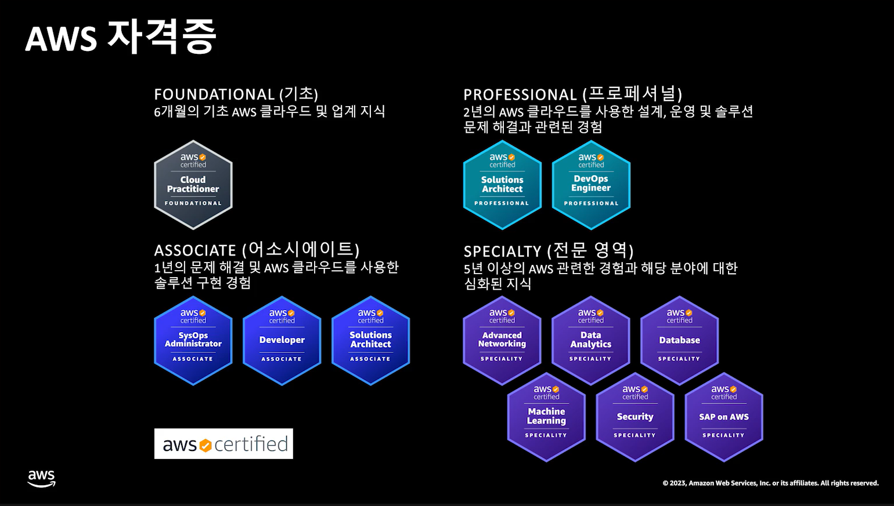
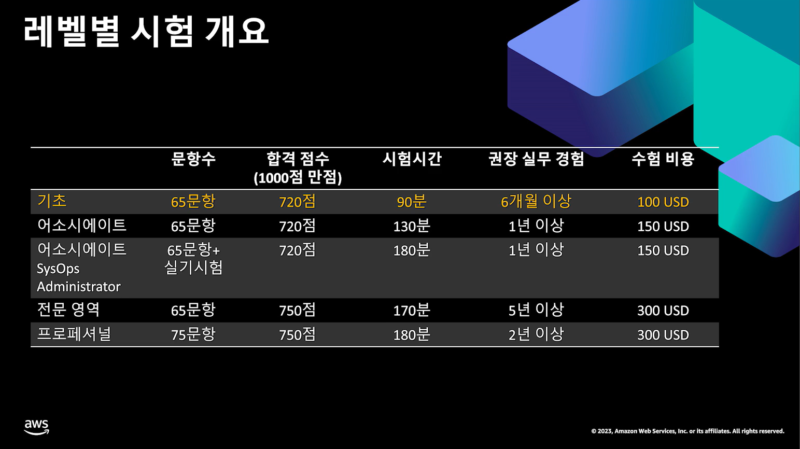

# AWS solutions architect professional

[AWS Certification 시험 준비] : https://aws.amazon.com/ko/certification/certification-prep/

[innovate] : https://innovate-modernapps-apj.virtual.awsevents.com/channel/t/316612252

AWS 자격증은 클라우드환경을 사용하는데 필수는 아니지만 클라우드 개발을 하는데 있어서 단순히 클라우드상의 서비스만을 사용 하는게 아닌 서비스와의 연동 개발등을 하는데 있어서 이해의 깊이와 사내 지원을 하여 주기에 습득 가능한 자격증을 모두 검토 할 수 있도록 하자.

현재는 ASSOCIATE, PROFESSIONAL의 영역만을 보자.

* AWS Certified Solutions Architect - Associate
* AWS Certified Developer - Associate
* AWS Certified SysOps Administrator - Associate
* AWS Certified Solutions Architect - Professional
* AWS Certified DevOps Engineer - Professional

> 합겹은 100점 만점에서 75점을 기준으로 ...

### 시험 준비 (환경)

* 웹캠, 마이크/스피커 준비
* 사전 시스템 테스트 확인
* 전용 클라이언트 설치 (확인 필요)
* 백그라운드 어플 모두 종료 (Docker, 메세징, 보안등...)

* 혼차 독립된 공간
* 책상위는 비어있어야 함
* 30분전 체크인
* 여권을 통해서 신분 확인 (영어 이름이 명시되어 있어야한다.)

* 온라인 감독관은 (영어 또는 일본어 사용)

> 음료와 소소한 간식은 허용 된다고... 

### PS

모든 시험의 필요한 자료와 리소스는 AWS Skill Builder를 통해서 얻을 수 있다. (개별 가입 필요)

[skill builder develop associate](https://explore.skillbuilder.aws/learn/course/14724/play/73781/introduction-to-aws-certification)

> 거의 모든 리소스가 해당 서비스에 있다. (한글제공이 되지 않는 리소스또한 많다...)

하지만 추가로 많은 문제를 풀려고 한다면 구독 또는 팀 구독을 통하여 해당 리소스를 추가로 얻을 수 있다. (첫 7일은 무료, *개별 구독은 최저 월 29 USD*)

-----

### 시험 예약

[certmetrics] : https://www.certmetrics.com/amazon

준비 : AWS SkillBuilder 계정(개인용 권장)

1. 간략히 "Pearson VUE로 예약" 의 버튼을 클릭 한다.
2. "OnVUE 시험"으로 선택 (원격으로 Test) 한다.
3. 시험 언어, 약관, 감독관언어(감독관과의 소통을 위한 언어), 시간대 선택을 한다.
4. 시험 날짜 및 test 일자를 선택 한다.
    1. 시험 시간은 보고자 하는 자격증 시험 마다 다르다.
    2. 시작 시간은 예약만 있다면 응시날 바로 보는것 또한 가능 하다.
    > 확인 하기로는 대부분의 시간이 비어있다.
5. 결제만 하였을 경우 시험 응모는 완료 된다.

-----

### DA (Developer - Associate)

[certified-developer-associate] : https://aws.amazon.com/ko/certification/certified-developer-associate/?c=sec&sec=resources

#### Notice

이 시험의 응시 대상은 누구인가요?
AWS Certified Developer - Associate는 다음 중 하나를 갖춘 개인을 위한 AWS Certification 경로의 좋은 출발점입니다.

한 개 이상의 고급 프로그래밍 언어에 관한 심층적인 지식을 바탕으로 개발자 역할로 근무한 경험
AWS 기술에 대한 경험
온프레미스 IT에 대한 풍부한 경험 및 클라우드로의 온프레미스 매핑에 대한 확실한 이해
기타 클라우드 서비스로 작업한 경험

### T

### 도메인 1 작업 설명 1.3 애플리케이션 개발에 데이터 저장소 사용

#### **다음에 대한 지식:**

- Amazon DynamoDB 키 및 인덱싱
- Amazon Simple Storage Service(Amazon S3) 계층 및 수명 주기 관리
- 캐싱 전략(예: 연속 쓰기, 연속 읽기, 지연 로딩 및 TTL(Time to Live))
- 클라우드 스토리지 옵션(예: 파일, 객체, 데이터베이스)
- CRUD(생성, 읽기, 업데이트 및 삭제) 작업
- 데이터베이스 일관성 모델(예: 강력한 일관성 및 최종 일관성)
- 임시 데이터 스토리지 패턴과 영구 데이터 스토리지 패턴의 차이점
- 쿼리 작업과 스캔 작업의 차이점
- 균형 잡힌 파티션 액세스를 위한 높은 카디널리티 파티션 키
- 관계형 및 비관계형 데이터베이스

### 도메인 2 작업 설명 2.3 애플리케이션 코드의 민감한 데이터 관리

#### **다음에 대한 지식:**

- 데이터 분류(예: 개인 식별 정보[PII] 및 보호 건강 정보[PHI])
- 환경 변수
- 비밀 관리(예: AWS Secrets Manager 및AWS Systems Manager의 기능인 Parameter Store)
- 안전한 자격 증명 처리

### 도메인 3 작업 설명 3.2 개발 환경에서 애플리케이션 테스트 

#### **다음에 대한 지식:**

- 애플리케이션 배포를 수행하는 AWS 서비스의 기능
- 모의 엔드포인트를 사용하는 통합 테스트
- Lambda 버전 및 별칭

#### Topic

- [아마존 SQS](https://aws.amazon.com/sqs/faqs/?da=sec&sec=prep)
- [아마존 다이나모DB](https://aws.amazon.com/dynamodb/faqs/?da=sec&sec=prep)
- [아마존 엘라스티캐시](https://aws.amazon.com/elasticache/faqs/?da=sec&sec=prep)
- [아마존 키네시스](https://aws.amazon.com/kinesis/data-streams/faqs/?da=sec&sec=prep)
- [AWS 람다](https://aws.amazon.com/lambda/faqs/?da=sec&sec=prep)
- [아마존 API 게이트웨이](https://aws.amazon.com/api-gateway/faqs/?da=sec&sec=prep)
- [AWS 엘라스틱 빈스토크](https://aws.amazon.com/elasticbeanstalk/faqs/?da=sec&sec=prep)
- [AWS ID 및 액세스 관리](https://aws.amazon.com/iam/faqs/?da=sec&sec=prep)
- [AWS 키 관리 서비스](https://aws.amazon.com/kms/faqs/?da=sec&sec=prep)

### SAA (Solutions Architect - Associate)

> 보류

### SAP (Solutions Architect - Professional)

#### Notice

AWS Certified Solutions Architect - Professional의 대상은 AWS에서 클라우드 아키텍처를 설계 및 배포한 실무 경력이 2년 이상인 사람입니다. 이 시험에 응시하려면 다음 조건을 갖추고 있는 것이 좋습니다.

AWS CLI, AWS API, AWS CloudFormation 템플릿, AWS 결제 콘솔, AWS 관리 콘솔, 스크립팅 언어, Windows 및 Linux 환경에 대한 지식

기업의 여러 애플리케이션 및 프로젝트 전반에 걸쳐 아키텍처 설계에 대한 모범 사례 지침을 제공하는 능력과 비즈니스 목표를 애플리케이션/아키텍처 요구 사항에 매핑하는 능력

클라우드 애플리케이션 요구 사항을 평가하고, AWS에서 애플리케이션을 구현, 배포 및 프로비저닝하는 데 필요한 설계적 추천을 할 수 있는 능력

주요 AWS 기술(예: VPN, AWS Direct Connect)과 지속적인 통합 및 배포 프로세스를 사용하여 하이브리드 아키텍처를 설계할 수 있는 능력

#### 주제

* AWS CLI
* AWS API
* AWS CloudFormation
* AWS 결제 콘솔
* AWS 관리 콘솔
* 스크립팅 언어
* Windows 및 Linux 환경에 대한 지식
* 애플리케이션/아키텍처 요구 사항에 매핑
* 애플리케이션을 구현, 배포, 프로비저닝하는 데 필요한 설계적 추천
* 주요 AWS 기술(예: VPN, AWS Direct Connect)과 지속적인 통합 및 배포 프로세스를 사용하여 하이브리드 아키텍처를 설계

#### Topic 

- [AWS Key Management Service의 보안 모범 사례](https://docs.aws.amazon.com/kms/latest/developerguide/best-practices.html)
- [미사용 데이터 암호화](https://docs.aws.amazon.com/whitepapers/latest/efs-encrypted-file-systems/encryption-of-data-at-rest.html)
- [AWS 클라우드의 웹 애플리케이션 호스팅](https://docs.aws.amazon.com/whitepapers/latest/web-application-hosting-best-practices/welcome.html)
- [AWS에서 지속적인 통합 및 지속적인 전달 실행](https://docs.aws.amazon.com/whitepapers/latest/practicing-continuous-integration-continuous-delivery/welcome.html)
- [AWS의 마이크로서비스 아키텍처](https://docs.aws.amazon.com/whitepapers/latest/microservices-on-aws/simple-microservices-architecture-on-aws.html)
- [AWS Well-Architected 프레임워크](https://docs.aws.amazon.com/wellarchitected/latest/framework/welcome.html)
- [재해 복구를 위해 Amazon Web Services 사용](https://d1.awsstatic.com/whitepapers/aws-disaster-recovery.121b65092f931567af5370b47dd12cb18866089c.pdf)
- [AWS 아키텍처 센터 아키텍처 백서](https://aws.amazon.com/whitepapers/?achp_navlib6&whitepapers-main.sort-by=item.additionalFields.sortDate&whitepapers-main.sort-order=desc&awsf.whitepapers-content-type=*all&awsf.whitepapers-global-methodology=*all&awsf.whitepapers-tech-category=*all&awsf.whitepapers-industries=*all&awsf.whitepapers-business-category=*all)
- [AWS의 내결함성 구성 요소](https://d1.awsstatic.com/whitepapers/aws-building-fault-tolerant-applications.pdf)
- [AWS 보안 모범 사례](https://d1.awsstatic.com/whitepapers/Security/AWS_Security_Best_Practices.pdf)
- [AWS 스토리지 서비스 개요](https://d1.awsstatic.com/whitepapers/AWS%20Storage%20Services%20Whitepaper-v9.pdf)
- [Amazon Web Services: 보안 프로세스 개요](https://d1.awsstatic.com/whitepapers/Security/AWS_Security_Whitepaper.pdf)
- [AWS 클라우드 채택 프레임워크 개요](https://docs.aws.amazon.com/whitepapers/latest/overview-aws-cloud-adoption-framework/welcome.html)

### DEP (DevOps Engineer - Professional)

> 보류

---

### 시험 준비 Reference

https://aws.amazon.com/ko/certification/certification-prep/

- [AWS Certified Developer - Associate
](https://aws.amazon.com/ko/certification/certified-developer-associate/?c=sec&sec=resources)
- [AWS Certified Solutions Architect - Professional](https://aws.amazon.com/ko/certification/certified-solutions-architect-professional/?c=sec&sec=resources)

---

### Reference

[모든 AWS Certification 시험 살펴보기](https://aws.amazon.com/ko/certification/exams/)

[AWS 자격증의 종류와 취득 노하우를 알려드립니다](https://innovate-modernapps-apj.virtual.awsevents.com/media/AWS+%EC%9E%90%EA%B2%A9%EC%A6%9D%EC%9D%98+%EC%A2%85%EB%A5%98%EC%99%80+%EC%B7%A8%EB%93%9D+%EB%85%B8%ED%95%98%EC%9A%B0%EB%A5%BC+%EC%95%8C%EB%A0%A4%EB%93%9C%EB%A6%BD%EB%8B%88%EB%8B%A4/1_zo1lpalh)

[official-practice-question-set-sap-c02-korean](https://explore.skillbuilder.aws/learn/course/13385/play/55158/aws-certified-solutions-architect-professional-official-practice-question-set-sap-c02-korean)

https://aws.amazon.com/ko/certification/certified-solutions-architect-professional/.

