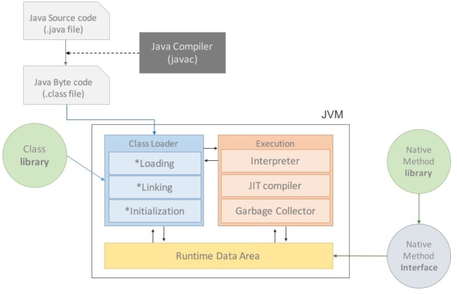

## JVM의 구조

* Class Loader:

클래스 로더는 자바 클래스 파일들을 로드하여 JVM의 메모리에 적재합니다.
클래스 로더는 클래스를 찾고, 로드하고, 링크하며, 초기화하는 역할을 수행합니다.
클래스 로더는 계층 구조로 구성되어 있으며, 클래스 로딩을 위한 다양한 전략과 정책을 사용합니다.

* Runtime Data Area:

Runtime Data Area는 JVM의 메모리 영역입니다.
주요한 구성 요소로는 Method Area, Heap, Stack, PC Register, Native Method Stack 등이 있습니다.

Method Area: 클래스의 정보(정적 변수, 메소드 코드 등)를 저장하는 공유 메모리 영역입니다.

Heap: 동적으로 할당되는 객체의 인스턴스와 배열을 저장하는 메모리 영역입니다.

Stack: 메소드 호출과 관련된 정보(로컬 변수, 매개변수, 임시 데이터)를 저장하는 메모리 영역입니다.

PC Register: 현재 실행 중인 JVM 명령의 주소를 저장하는 메모리 영역입니다.

Native Method Stack: 네이티브 코드(다른 언어로 작성된 코드)를 실행하는 메모리 영역입니다.

* Execution Engine:

Execution Engine은 JVM의 핵심 엔진으로, 바이트코드를 실행하는 역할을 수행합니다.
주요한 구성 요소로는 Interpreter, JIT Compiler, Garbage Collector 등이 있습니다.

Interpreter: 바이트코드를 한 줄씩 해석하고 실행하는 역할을 수행합니다.

JIT(Just-In-Time) Compiler: 인터프리터에 의해 반복적으로 실행되는 코드를 동적으로 컴파일하여 네이티브 코드로 변환합니다.

Garbage Collector: 더 이상 참조되지 않는 객체를 탐지하고 메모리를 회수하는 역할을 수행합니다.

* Native Method Interface (JNI):

JNI는 자바 코드에서 네이티브 코드(C, C++ 등의 다른 언어로 작성된 코드)를 호출하고 상호작용하기 위한 인터페이스를 제공합니다.
JNI를 통해 자바 코드와 네이티브 코드 간의 통합이 가능합니다.
JVM은 자바 프로그램의 포터빌리티(Portability)와 안정성을 제공하며, 메모리 관리와 스레드 관리 등을 자동으로 처리하여 개발자의 부담을 줄여줍니다. JVM은 플랫폼 독립적인 실행 환경을 제공하여 자바의 "한 번 작성, 어디서든 실행"의 원칙을 실현합니다.

---

---

## 자바 가비지 콜렉터(Garbage Collector)

자바 가비지 콜렉터(Garbage Collector)는 자바 가상 머신(JVM)에서 동작하는 메모리 관리 기능입니다. 가비지 콜렉터는 프로그램에서 사용하지 않는 메모리를 자동으로 탐지하고 회수하여 해제하는 역할을 수행합니다. 다양한 가비지 콜렉터가 있으며, 주요 가비지 콜렉터의 종류와 간단한 동작 방식은 다음과 같습니다:

Serial GC:

싱글 스레드로 동작하는 가비지 콜렉터입니다.
콜렉션 작업을 위해 애플리케이션 스레드를 정지시킵니다(STW, Stop-The-World).
Young 영역과 Old 영역을 갖고 있으며, Young 영역에서는 Minor GC(새로운 객체가 생성되는 영역)를 수행합니다.
Parallel GC:

멀티 스레드로 동작하는 가비지 콜렉터입니다.
Serial GC와 비슷하게 콜렉션 작업을 위해 애플리케이션 스레드를 정지시킵니다.
Parallel Scavenge와 Parallel Old라는 두 개의 가비지 콜렉터로 구성되어 있으며, 콜렉션 작업을 병렬로 처리합니다.
CMS (Concurrent Mark Sweep) GC:

멀티 스레드와 동시 실행을 지원하는 가비지 콜렉터입니다.
애플리케이션 스레드와 병렬로 실행되며, 정지 시간을 최소화하여 응답성을 향상시킵니다.
Old 영역을 효율적으로 관리하여 메모리 회수 작업을 수행합니다.
일시적으로 애플리케이션 스레드를 정지시키는 STW 단계가 있습니다.
G1 (Garbage-First) GC:

멀티 스레드와 동시 실행을 지원하는 가비지 콜렉터입니다.
Young 영역과 Old 영역을 관리하지 않고, 대신 여러 개의 작은 영역인 리전(Region)으로 구성됩니다.
리전 단위로 메모리 회수 작업을 수행하며, 사용량이 높은 리전부터 우선적으로 처리합니다.
STW 시간을 최소화하고 예측 가능한 정지 시간을 제공하여 응답성을 향상시킵니다.
각 가비지 콜렉터는 JVM의 특정 버전 및 구성에 따라 다양한 동작 방식과 알고리즘을 가지고 있습니다. 이들 가비지 콜렉터는 자동으로 메모리 회수 작업을 수행하여 개발자가 명시적으로 메모리 관리를 할 필요가 없게 해주며, 애플리케이션의 성능과 응답성을 향상시킵니다.

---

## REF

https://doozi0316.tistory.com/m/entry/1%EC%A3%BC%EC%B0%A8-JVM%EC%9D%80-%EB%AC%B4%EC%97%87%EC%9D%B4%EB%A9%B0-%EC%9E%90%EB%B0%94-%EC%BD%94%EB%93%9C%EB%8A%94-%EC%96%B4%EB%96%BB%EA%B2%8C-%EC%8B%A4%ED%96%89%ED%95%98%EB%8A%94-%EA%B2%83%EC%9D%B8%EA%B0%80