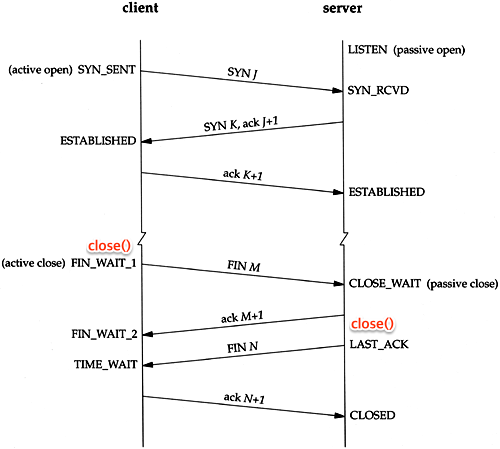

## netstat socket status

* ESTABLISHED (확립됨): 이 상태의 소켓은 활성 연결을 나타냅니다. 통신이 수립되어 패킷이 교환되고 있는 상태입니다.

* LISTEN (대기 중): 이 상태의 소켓은 들어오는 연결을 대기하고 있습니다. 서버 소켓이 클라이언트 연결을 수신하기 위해 대기 중인 상태입니다.

* SYN_SENT (SYN 보냄): 이 상태의 소켓은 연결을 수립하기 위해 SYN 패킷을 보내고 있습니다. 클라이언트가 서버에 연결을 요청하면 클라이언트 소켓이 이 상태로 전환됩니다.

* SYN_RECEIVED (SYN 받음): 이 상태의 소켓은 SYN 패킷을 받은 후 SYN+ACK 패킷을 보내고 있습니다. 서버가 클라이언트에게 연결 응답을 보내는 중인 상태입니다.

* FIN_WAIT_1 (FIN 대기 1): 이 상태의 소켓은 연결 종료를 위해 FIN 패킷을 보냈습니다. 다른 쪽에서 연결을 닫을 때까지 대기 중입니다.

* FIN_WAIT_2 (FIN 대기 2): 이 상태의 소켓은 다른 쪽에서 연결을 닫을 때까지 대기 중인 상태입니다. FIN_WAIT_1 상태 이후에 이 상태로 전환됩니다.

* CLOSE_WAIT (CLOSE 대기): 이 상태의 소켓은 원격 호스트로부터 연결 종료 요청을 받았지만 로컬에서 연결을 닫지 않은 상태입니다. 로컬에서 연결을 닫을 때까지 대기 중입니다.

* TIME_WAIT (시간 대기): 이 상태의 소켓은 연결 종료를 마친 후 일정 시간 동안 대기 중입니다. TIME_WAIT 상태에 있는 소켓은 일정 시간 후에 자동으로 닫힙니다.

* CLOSED (닫힘): 이 상태의 소켓은 닫힌 상태를 나타냅니다. 연결이 종료되었거나 생성되지 않은 상태입니다.


```
LAST_ACK는 TCP 연결 종료 과정에서 발생하는 소켓 상태 중 하나입니다. LAST_ACK 상태는 TCP 연결을 종료하기 위해 한 쪽에서 연결 종료 요청(FIN 패킷)을 보내고, 상대방에서 연결 종료 응답(ACK 패킷)을 받은 후 대기하는 상태를 나타냅니다.

LAST_ACK 상태에서는 클라이언트(요청을 보낸 측)가 서버로부터 연결 종료 응답을 받았지만, 아직 클라이언트 측에서 ACK 패킷을 확인하지 못한 경우입니다. 클라이언트는 이 상태에서 일정 시간 동안 대기하며, ACK 패킷을 기다립니다. 이후 ACK 패킷을 받으면 클라이언트는 연결이 완전히 종료되었음을 인식하고 소켓을 닫습니다.

LAST_ACK 상태는 TCP 연결 종료 과정에서 잠깐의 대기 상태를 나타내며, 정상적인 연결 종료 시나리오에서는 일시적으로 발생합니다. 그러나 상대방이 ACK 패킷을 보내지 않거나, TIMEOUT 등의 이유로 ACK 패킷을 기다리는 시간이 길어질 경우에는 이로 인해 지연이 발생할 수 있습니다.

네트워크에서 소켓 상태가 LAST_ACK로 남아있는 경우, 이는 연결 종료 프로세스가 완료되지 않았음을 나타낼 수 있으므로, 문제가 있는지 확인하고 필요한 조치를 취해야 합니다.
```



## REF

https://benohead.com/blog/2013/07/21/tcp-about-fin_wait_2-time_wait-and-close_wait/

https://tech.kakao.com/2016/04/21/closewait-timewait/