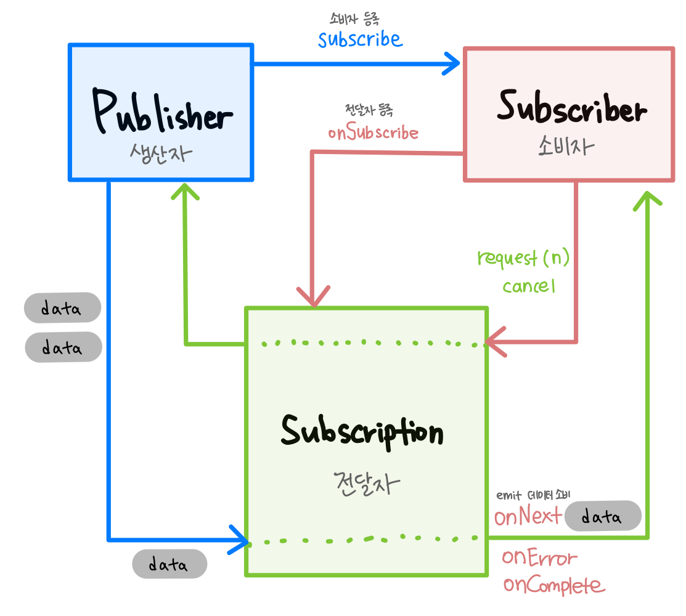
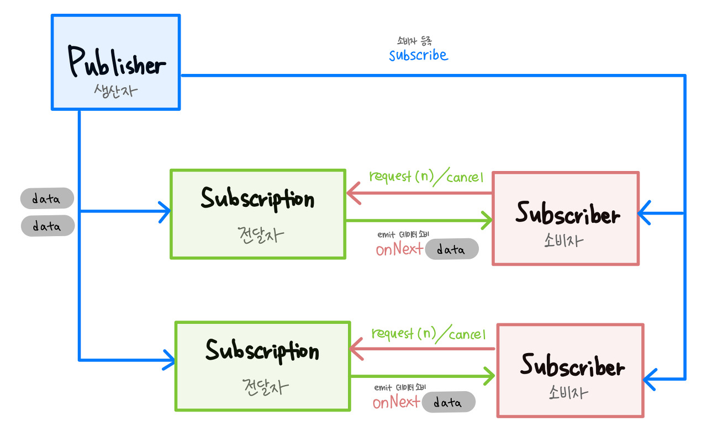

## 리액티브 스트림의 구성 요소

* Publisher (발행자):
Publisher는 리액티브 스트림의 데이터를 발행하는 역할을 합니다. 데이터를 비동기적으로 생성하고, Subscriber에게 전달합니다. 예를 들면, Flux나 Mono 클래스가 Publisher의 역할을 수행합니다.

* Subscriber (구독자):
Subscriber는 Publisher로부터 데이터를 받아 처리하는 역할을 합니다. 데이터를 비동기적으로 받아 처리하고, 원하는 작업을 수행합니다. Subscriber는 데이터의 수신, 완료, 에러 처리 등을 담당합니다.

* Subscription (구독):
Subscription은 Publisher와 Subscriber 간의 연결을 나타냅니다. Subscriber가 Publisher에게 구독 요청을 보내고, Publisher는 Subscription 객체를 생성하여 Subscriber에게 반환합니다. Subscription을 통해 Subscriber는 데이터의 요청, 취소, 완료 등을 관리할 수 있습니다.

* Processor (처리기):
Processor는 Publisher와 Subscriber의 역할을 동시에 수행하는 중간 컴포넌트입니다. Processor는 데이터의 발행과 구독을 모두 처리할 수 있으며, 데이터의 가공, 변환, 필터링 등의 작업을 수행할 수 있습니다.

---






---

## 리액티브의 특징

1. Responisve : 클라이언트의 요청에 즉각적으로 응답할 수 있어야한다.

2. Maintainable : 요청에 대한 즉각적인 응답이 지속 가능해야 한다.

3. Extensible : 요청에 대한 처리량을 자동으로 확장하고 축소할 수 있어야한다. 

---

## 설명

리액티브 스트림(Reactive Streams)은 비동기 및 논블로킹 애플리케이션 개발을 위한 리액티브 프로그래밍 모델의 일부입니다. 리액티브 스트림은 데이터 스트림의 비동기 처리와 관련된 다양한 연산자와 개념을 제공하여 반응성, 탄력성, 효율성을 갖춘 애플리케이션을 개발할 수 있도록 도와줍니다.

리액티브 스트림의 주요 특징과 개념은 다음과 같습니다:

비동기 및 논블로킹:
리액티브 스트림은 비동기 및 논블로킹 작업을 위해 설계되었습니다. 데이터 스트림의 발행과 구독이 비동기적으로 이루어지며, 블로킹 작업 없이 데이터를 처리할 수 있습니다. 이를 통해 애플리케이션의 응답성과 성능을 향상시킬 수 있습니다.

Publisher와 Subscriber:
리액티브 스트림은 Publisher(발행자)와 Subscriber(구독자) 사이의 데이터 흐름을 관리합니다. Publisher는 데이터를 발행하고, Subscriber는 데이터를 구독하여 처리합니다. 데이터는 비동기적으로 발행되며, Subscriber는 필요한 만큼 데이터를 요청하여 처리할 수 있습니다.

Subscription:
Subscription은 Publisher와 Subscriber 사이의 연결을 나타냅니다. Subscriber는 Subscription을 통해 데이터의 요청, 취소, 완료 등을 관리합니다. Subscription을 사용하여 데이터 흐름을 제어하고, 백프레셔(Backpressure)를 통해 데이터 생산과 소비를 조절할 수 있습니다.

Operators:
리액티브 스트림은 다양한 연산자를 제공하여 데이터 스트림을 가공하고 변환할 수 있습니다. 예를 들어, 데이터의 필터링, 매핑, 변환, 조합 등을 수행할 수 있습니다. Operators를 사용하여 데이터 스트림을 조작하고, 비즈니스 로직을 구현할 수 있습니다.

리액티브 스트림은 비동기적이고 탄력적인 애플리케이션 개발을 위한 강력한 도구입니다. 데이터 스트림의 비동기 처리와 관련된 문제를 해결하고, 확장성과 반응성을 갖춘 애플리케이션을 개발할 수 있도록 도와줍니다. Java에서는 Reactor, RxJava 등의 라이브러리를 사용하여 리액티브 스트림을 구현하고 활용할 수 있습니다.

---

## map flatmap

|        | Map                    | FlatMap                  |
| ------ | ---------------------- | ------------------------ |
| Input  | 1개의 데이터 요소      | 1개 이상의 데이터 요소   |
| Output | 1:1 매핑된 데이터 요소 | 변환된 데이터 스트림     |
| 동작   | 각 요소를 변환         | 각 요소를 변환 및 병합   |
| 활용   | 개별적인 변환 작업     | 비동기 및 병렬 처리 작업 |

----

## 예외 처리 (mono.error, throw)

### Mono.error:

Mono.error는 Mono 스트림에서 예외를 발생시키는 메소드입니다. 예외를 Mono 스트림에 즉시 실어서 에러 상태로 만듭니다. 이렇게 생성된 Mono 스트림은 에러를 발생시키고 종료됩니다. 이후에 다른 연산자나 구독자에게 에러 신호를 전달할 수 있습니다.

예를 들어, Mono.error(new RuntimeException("Something went wrong"))는 런타임 예외를 발생시키고 해당 예외를 가진 Mono 스트림을 생성합니다.

### throw:

throw는 일반적인 예외 처리 방법으로, 예외를 직접 던지는 키워드입니다. throw는 예외를 호출자에게 전달하고, 예외가 발생한 곳에서 프로그램의 흐름이 중단됩니다. 일반적으로 예외를 캐치하여 처리하는 try-catch 블록과 함께 사용됩니다.

예를 들어, throw new RuntimeException("Something went wrong")는 런타임 예외를 직접 던지는 문장입니다.

```
주요 차이점:

Mono.error는 리액티브 스트림에서 예외를 발생시켜 스트림의 에러 상태로 만듭니다. 따라서 리액티브 프로그래밍의 흐름에 맞게 예외를 처리하고 전달할 수 있습니다.
throw는 일반적인 예외 처리 방법으로, 예외를 직접 던져서 호출자에게 전달하고 프로그램의 흐름을 중단시킵니다. 리액티브 스트림의 흐름을 따르지 않습니다.
따라서 리액티브 프로그래밍에서는 Mono.error를 사용하여 예외를 리액티브 스트림에 포함시키고, 일반적인 예외 처리는 throw를 사용하여 직접 처리하는 것이 일반적입니다.
```

---

## REF

https://jie0025.tistory.com/546

https://timewizhan.tistory.com/entry/Reactor-%EC%98%88%EC%99%B8-%EB%B0%9C%EC%83%9D%EC%97%90-%EB%8C%80%ED%95%B4