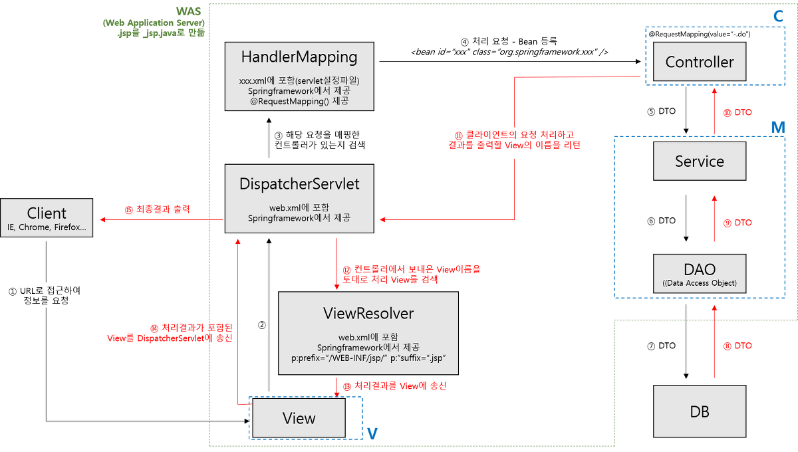
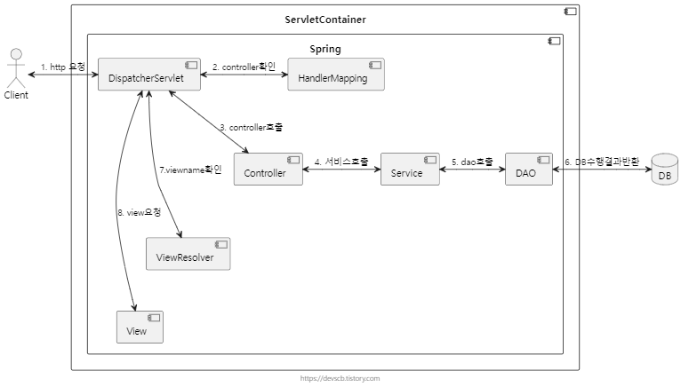
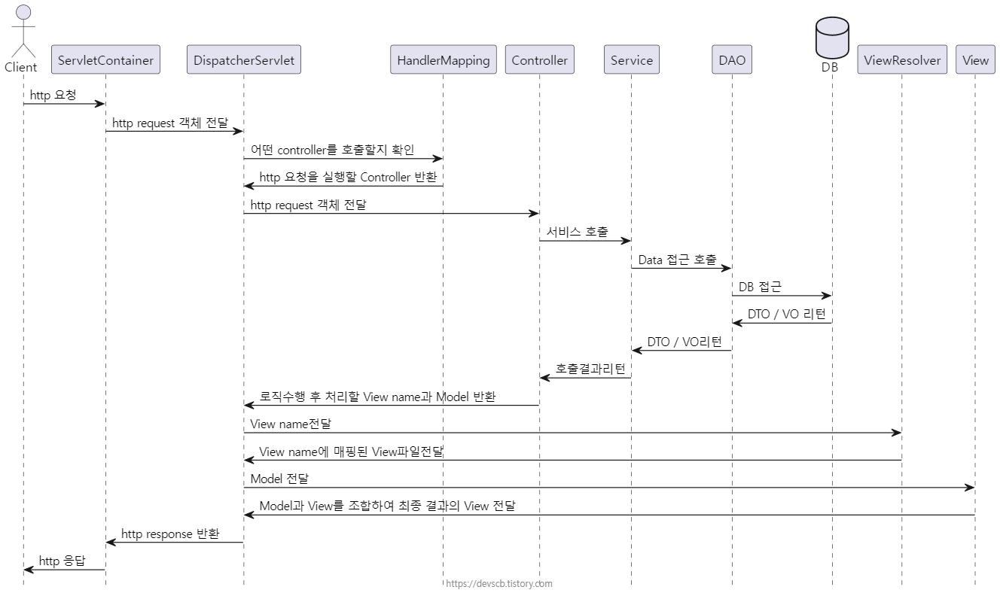
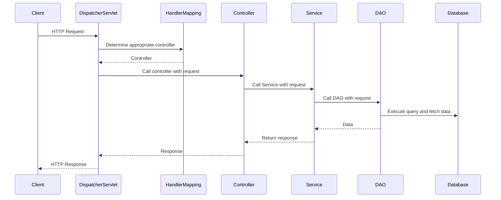

### 요소

* ServletContainer (서블릿 컨테이너)
Client (보통 크롬, 파이어폭스 등과 같은 웹브라우저)로부터 HTTP요청을 받아 서블릿 로직을 처리할 수 있는 구성요소입니다.

서블릿이란 javax.servlet 패키지에 정의된 인터페이스로, 자바 class 파일로 된 서버로직이라고 볼 수 있습니다.
ServletContainer의 대표적인 예로는 Tomcat이 있습니다.

* Spring (스프링)
Spring framework (스프링 프레임워크) 영역입니다.

* DispatcherServlet (디스패처 서블릿)
Spring framework (스프링 프레임워크)에서 front controller역할을 합니다.

실제 동작하기 위한 로직요청에 대해 처리할 수 있도록 해줍니다.
dispatch의 뜻을 보내다라는 뜻으로, 이곳에 요청이 오면 실제로 로직을 수행할 컴포넌트로 요청을 보내주는 역할을 하고, 반환을 받는 역할을 합니다.

* HandlerMapping (핸들러 매핑)
Spring framework(스프링 프레임워크)에 작성된 여러 Controller(컨트롤러) 중에서 로직을 수해할 contoller를 확인해주는 컴포넌트입니다.

* Controller (컨트롤러)
개발자가 직접 개발하는 컴포넌트로, http request를 개발자가 처리할 수 있도록 개발하는 컴포넌트입니다.

* Service (서비스)
개발자가 직접 개발하는 컴포넌트로, 비지니스 로직을 수행하는 컴포넌트이니다.

* DAO (Data Access Object, 디에이오)
개발자가 직접개발하는 컴포넌트로, Database에 직접적으로 접근하는 객체입니다.
보통 mybatis와 같은 persistence framework를 많이 활용합니다.

* ViewResolver (뷰 리졸버)
ViewName을 기반으로 어떤 View 파일을 사용할것인지 확인해주는 컴포넌트입니다.

* View (뷰)
개발자가 직접개발하는 컴포넌트로, 보통 UI화면을 의미합니다.

---

### UML

---

1. 클라이언트가 Request 요청을 하면 DispatcherServlet이 요청을 가로챕니다.

  > 이때 DispatcherServlet이 모든 요청을 가로채는건 아니고 web.xml에 <url-pattern>에 등록된 내용만 가로챕니다.

2. DispatcherServlet이 가로챈 요청을 HandlerMapping에게 보내 해당 요청을 처리할 수 있는 Controller를 찾습니다.

3. 실제 로직 처리 
> (Controller -> Service -> DAO -> DB -> DAO -> Service -> Controller)

4. 로직 처리 후 ViewResolver를 통해 view 화면을 찾습니다.

5. View화면을 최종 클라이언트에게 전송합니다.

---

## Ref

https://devscb.tistory.com/m/119

https://intro0517.tistory.com/151