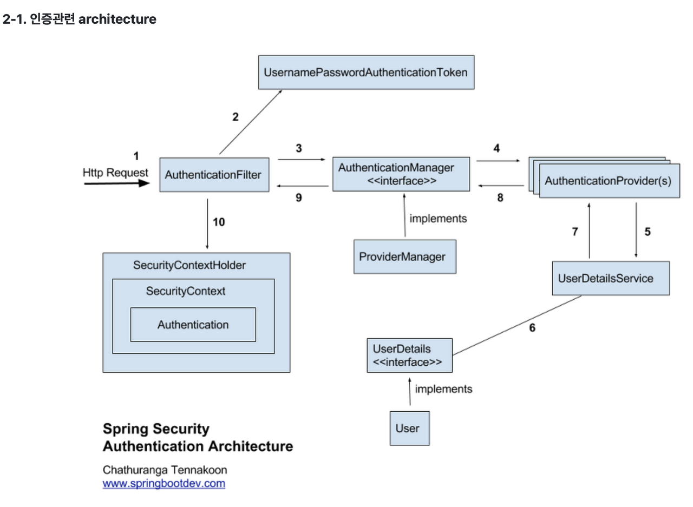

## 인증 과 인가

* Authentication(인증) : A 라고 주장하는 주체(user, subject, principal) 가 A가 맞는지 확인 하는 것.
코드에서 Authenitication : 인증 과정에서 사용되는 핵심 객체
ID/PASSWORD, JWT, OAuth 등 여러 방식으로 인증에 필요한 값이 전달되는데 이것을 하나의 인터페이스로 받아 수행하도록 추상화 하는 역할의 인터페이스 이다.

* Authorization(인가) : 특정 자원에 대한 권한이 있는지 확인하는 것
인증(Authentication) 을 거치고 인증이 되었으면 권한/인가(Authorization) 이 있는지 확인 후, 서버 자원에 대해서 접근 할 수 있게 되는 순서

* Credential(증명서) : 인증 과정 중, 주체가 본인을 인증하기 위해 서버에 제공하는 것(ID/PASSWORD)

-----



```
1.사용자가 로그인 정보와 함께 인증 요청(HttpRequest)

2.AuthenticationFilter 가 요청을 가로챔, 이때 가로챈 정보를 통해 UsernamePasswordAuthenticationToken객체(현재 미검증 Authentication) 생성

3.ProviderManager 구현체인 AuthenticationManager에게 UsernamePasswordAuthenticationToken객체를 전달

4.AuthenticationProvider에 UsernamePasswordAuthenticationToken 객체를 전달

5.실제 DB로부터 사용자 인증 정보를 가져오는 UserDetailsService에 사용자 정보를 넘겨줌

6.넘겨받은 정보를 통해 DB에서 찾은 사용자 정보인 UserDetails객체를 생성

7.AuthenticationProvider는 UserDetials를 넘겨 받고 사용자 정보를 비교

8.인증이 완료되면, 사용자 정보를 담은 Authentication 객체를 반환

9.최초의 AuthenticationFitler에 Authentication객체가 반환됨

10.Authentication 객체를 SecurityContext에 저장
```


----


### REF

https://velog.io/@park9910/Spring-Security-%EA%B5%AC%EC%A1%B0-%EB%B0%8F-%EC%97%AD%ED%95%A0

https://twer.tistory.com/entry/Security-%EC%8A%A4%ED%94%84%EB%A7%81-%EC%8B%9C%ED%81%90%EB%A6%AC%ED%8B%B0%EC%9D%98-%EC%95%84%ED%82%A4%ED%85%8D%EC%B2%98%EA%B5%AC%EC%A1%B0-%EB%B0%8F-%ED%9D%90%EB%A6%84

https://russell-seo.tistory.com/12

https://kimchanjung.github.io/programming/2020/07/01/spring-security-01/